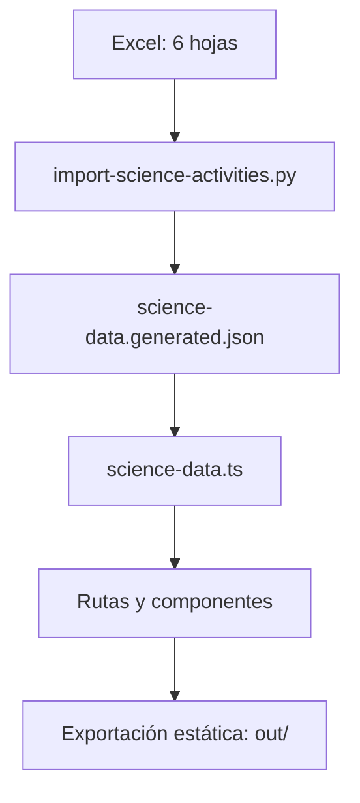
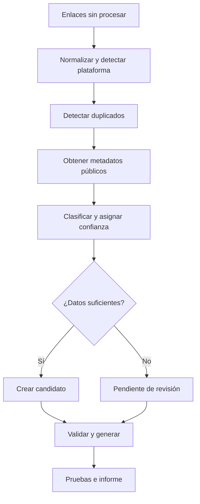

# Arquitectura multiasignatura y plan de migración

Estado: propuesta ejecutable, sin implementación

Repositorio auditado: `t2wmt6sgff-glitch/Actividades-de-ciencias`

Commit de referencia: `db52c4a2dbafa5ac066238288c90d10ff58d8d1c`

Fecha de auditoría: 22 de septiembre de 2026

## Resumen ejecutivo

El proyecto actual es una aplicación Next.js 16 exportada íntegramente como archivos estáticos. Conserva correctamente 65 actividades únicas, 11 secciones, 69 relaciones actividad-sección y 4 actividades asignadas a dos secciones. El diseño es data-driven y la compilación, las pruebas y ESLint pasan en el commit auditado.

La migración no necesita backend, base de datos, autenticación ni reconstrucción visual. La recomendación es mantener la exportación estática y el Excel como fuente editable, convertir el libro actual en un catálogo general y generar JSON validado. La interfaz debe leer asignaturas, temas, filtros, recuentos y elementos visuales desde datos, no desde listas específicas de Ciencias.

Las decisiones principales son:

- Mantener una entidad única por actividad y relaciones muchos-a-muchos con temas.
- Permitir varias asignaturas por actividad mediante `subjectIds`, con una asignatura principal, para evitar duplicados en recursos interdisciplinares.
- Separar el estado editorial de la actividad del estado de verificación de un enlace externo.
- Modelar actividades externas y nativas como una unión discriminada desde la primera migración.
- Usar `publishedAt` como fecha de incorporación pública al catálogo. `createdAt`, `updatedAt` y `external.lastVerifiedAt` tienen significados distintos.
- Conservar `/actividad/{slug}` y `/sobre-el-proyecto`. Mantener `/actividades` y las rutas `/seccion/{slug}` como alias estáticos compatibles mientras las rutas principales pasan a `/explorar` y `/asignatura/...`.
- Mantener un único Excel general por ahora. Un generador produce un catálogo normalizado y un índice de búsqueda. El CI debe regenerar y fallar si los artefactos no coinciden.
- Introducir asignaturas mediante configuración y datos. Añadir una asignatura no debe requerir editar componentes React.

La siguiente misión puede comenzar por la Fase 1, que generaliza el contrato, el generador y las pruebas sin cambiar todavía las rutas ni el diseño público.

## A. Estado real del repositorio

### A.1 Arquitectura y tecnologías

| Área | Estado real |
| --- | --- |
| Framework | Next.js `16.2.6`, App Router |
| UI | React y React DOM `19.2.6`, TypeScript `5.9.3` |
| Estilos | Tailwind CSS `4.2.1`, CSS global y componentes Radix/shadcn vendorizados |
| Iconos | `lucide-react` |
| Salida | `output: "export"`, HTML/CSS/JS estáticos en `out/` |
| Imágenes | WebP locales, `images.unoptimized: true` |
| Datos | Excel versionado y JSON generado versionado |
| Importación | Python y `openpyxl`; no hay `requirements.txt` ni ejecución del importador en CI |
| Pruebas | `node:test`; 5 pruebas de contrato básico y exportación |
| CI | GitHub Actions en `main` y pull requests; Node 22, `npm ci`, `npm test` |
| Despliegue | Documentado para Hostinger, pero no automatizado ni verificable desde el repositorio |

`npm test` y `npm run lint` pasan en el commit auditado. La compilación genera 81 páginas estáticas: portada, catálogo, página de proyecto, 404, 11 rutas de sección y 65 rutas de actividad.

El repositorio tiene tres commits. La web portable completa se introdujo el 6 de septiembre de 2026. No existen otras ramas remotas ni etiquetas en el momento de la auditoría.

### A.2 Flujo de datos real



El Excel contiene estas hojas:

| Hoja | Filas de datos | Función |
| --- | ---: | --- |
| `ACTIVIDADES` | 65 | Entidad única y metadatos de actividad |
| `SECCIONES` | 11 | Temas actuales |
| `RELACIONES` | 69 | Relación muchos-a-muchos actividad-sección |
| `CONTROL DE CALIDAD` | 1 | Incidencia que requiere revisión |
| `INFORMACIÓN` | 17 | Definiciones y procedencia |
| `AUDITORÍA` | 10 | Controles y recuentos de la extracción original |

El Excel adjunto y `data/Actividades_Ciencias_para_Sites.xlsx` tienen el mismo SHA-256. El JSON contiene una proyección de parte del libro más información, auditoría, incidencias y resúmenes.

La regeneración local con el script actual produce un archivo idéntico byte por byte a `lib/science-data.generated.json`. El problema no está en la reproducibilidad actual, sino en que CI no ejecuta esa comprobación.

El importador valida IDs, slugs y URL duplicados, relaciones huérfanas, recuentos de sección y cuatro totales esperados. Esos totales están fijados a 65 actividades, 11 secciones, 69 relaciones y 4 actividades multisección, por lo que cualquier crecimiento válido falla hasta editar el script.

### A.3 Rutas actuales

| Ruta | Implementación | Generación |
| --- | --- | --- |
| `/` | `app/page.tsx` | Estática |
| `/actividades` | `app/actividades/page.tsx` | Estática |
| `/seccion/{slug}` | `app/seccion/[slug]/page.tsx` | 11 páginas SSG |
| `/actividad/{slug}` | `app/actividad/[slug]/page.tsx` | 65 páginas SSG |
| `/sobre-el-proyecto` | `app/sobre-el-proyecto/page.tsx` | Estática |
| 404 | `app/not-found.tsx` | Estática |

La consulta y los filtros viven en la URL mediante `q`, `section`, `lang`, `type`, `platform` y `sort`. El catálogo se filtra en el cliente. Dentro de un filtro se usa OR y entre filtros se usa AND.

### A.4 Componentes y comportamiento

- `ActivityCatalog` contiene búsqueda, filtros, ordenación, sincronización de URL, estados vacíos y presentación responsive.
- `ActivityCard` diferencia la ficha interna del enlace externo.
- `ActivityThumbnail` deriva imagen, color e icono del tema y del tipo.
- `HomeSearch` envía la consulta a `/actividades`.
- `BackToResults` vuelve al historial cuando el referente procede del catálogo o una sección.
- `SiteHeader` y `SiteFooter` contienen navegación y marca específicas de Ciencias.
- Los componentes UI en `components/ui/` son infraestructura genérica y no están acoplados al dominio.

La búsqueda normaliza mayúsculas y tildes, exige que todos los términos estén presentes y considera título, título original, descripción, secciones, etiquetas, palabras clave, tipo, idioma y plataforma. La puntuación de relevancia solo distingue título, título original, etiquetas y descripción. Las coincidencias que solo proceden de tema, idioma, tipo o plataforma reciben la misma puntuación residual.

### A.5 Pruebas y CI

Las pruebas actuales verifican:

- 65 actividades, 11 secciones, 69 relaciones y 4 elementos multisección;
- unicidad de ID, slug y URL;
- plataformas, dominios y presencia del curso histórico;
- existencia de 79 rutas de contenido exportadas;
- existencia de las 11 imágenes;
- textos de autoría y créditos.

No verifican:

- que el JSON se pueda regenerar desde el Excel sin cambios;
- el esquema completo ni referencias entre asignatura, tema y actividad;
- búsqueda, relevancia, filtros o parámetros inválidos;
- alias de compatibilidad, canónicas o enlaces internos rotos;
- accesibilidad en navegador;
- layout en móvil/iPad;
- metadatos SEO, sitemap o datos estructurados;
- comportamiento de enlaces caídos;
- actividades nativas.

El workflow solo ejecuta `npm test`; el lint no forma parte de CI. Tampoco instala Python, fija una versión de Python ni declara `openpyxl`.

### A.6 Puntos fuertes

- Fuente tabular normalizada, con actividades únicas y relaciones muchos-a-muchos.
- IDs y slugs estables en los 65 registros actuales.
- Exportación estática barata, portable y apropiada para el volumen previsto.
- Navegación responsive y controles táctiles de al menos 44 px.
- Buenas bases de accesibilidad: enlace de salto, foco visible, etiquetas, `aria-live`, reducción de movimiento y separación entre ficha interna y salida externa.
- Autoría, procedencia y créditos visibles.
- Datos y vistas separados. No existen 65 páginas editadas a mano.

### A.7 Deuda técnica relevante

- Los tipos TypeScript se infieren directamente del JSON. No existe un contrato explícito ni validación en tiempo de generación.
- El JSON generado incluye información y auditoría que la interfaz no necesita. El cliente importa el catálogo completo.
- El Excel y el JSON pueden desincronizarse sin que CI falle.
- El importador depende de `openpyxl` sin entorno reproducible.
- `npm run dev` ejecuta `vite out`: sirve una exportación previa y no ofrece desarrollo de Next con recarga de código. `vite` y `serve` cubren funciones solapadas.
- No hay sitemap, robots, URL canónicas, Open Graph ni datos estructurados. Solo las actividades generan metadatos propios.
- Dos imágenes tienen licencia de reutilización no acreditada y una tercera carece de procedencia/licencia. Es un riesgo de publicación, no un problema de arquitectura.
- No hay automatización de despliegue ni evidencia versionada de la configuración real de Hostinger.
- El comprobador de enlaces usa `HEAD`; algunas plataformas responden de forma distinta a `HEAD` y `GET`. No guarda historial ni actualiza el catálogo.
- La paleta depende de once clases `section-theme-1` a `section-theme-11` y del orden del tema.

## B. Inventario de acoplamientos a Ciencias

| Archivo o sistema | Acoplamiento actual | Cambio necesario |
| --- | --- | --- |
| `package.json` | Nombre `actividades-de-ciencias`; script de desarrollo sirve `out` con Vite | Renombrar el paquete cuando se defina el nombre general. Usar `next dev` y reservar `serve out` para previsualización |
| `README.md` | Nombre, recuentos, estructura y despliegue descritos como Ciencias | Actualizar después de la migración y documentar el catálogo general |
| `app/layout.tsx` | Título, descripción y cifras específicas | Leer marca y resumen desde configuración; añadir metadatos generales |
| `app/page.tsx` | Importa `sections`; textos de Ciencias; 65/11; Wordwall/Educaplay; tiles por tema | Derivar asignaturas, recientes y recuentos desde el catálogo; mantener la composición visual |
| `app/actividades/page.tsx` | Ruta y copia editorial del catálogo actual | Reutilizar una vista `ExplorePage`; conservarla como alias de `/explorar` |
| `app/seccion/[slug]/page.tsx` | Tema global sin asignatura; `section-theme-{order}` | Sustituir por ruta anidada de asignatura/tema; conservar esta ruta como alias legado |
| `app/actividad/[slug]/page.tsx` | Marca de Ciencias, URL externa obligatoria, plataforma siempre visible, idioma solo es/en | Consumir la unión external/native, códigos BCP 47, nuevas migas y metadatos canónicos |
| `app/sobre-el-proyecto/page.tsx` | 11 temas, 65 actividades, Ciencias, solo externos, créditos acoplados | Convertir cifras en datos y ampliar el relato sin perder autoría ni créditos existentes |
| `app/not-found.tsx` | CTA a `/actividades` | Apuntar a `/explorar` |
| `components/site-shell.tsx` | Marca, microscopio, navegación, plataformas y fecha fijas | Leer marca/configuración y nueva navegación; no listar asignaturas en la barra superior |
| `components/home-search.tsx` | Destino `/actividades` y placeholder limitado | Enviar a `/explorar`; búsqueda global |
| `components/activity-catalog.tsx` | Importa `science-data`; filtro `sections`; recuentos de idioma/plataforma fijos; orden por tema; no filtra asignatura/origen | Extraer motor de consulta; facetas dinámicas; `subject`, `topic`, `source`; usar IDs estables y etiquetas derivadas |
| `components/activity-card.tsx` | Tema como única clasificación; enlace externo obligatorio | Mostrar asignatura/tema y CTA según external/native |
| `components/activity-thumbnail.tsx` | `sectionById`, mapa fijo de tipos, clases por orden | Resolver tema/asignatura desde el catálogo; configuración visual por datos; fallback genérico |
| `components/back-to-results.tsx` | Reconoce solo `/actividades` y `/seccion/` | Reconocer `/explorar`, `/recientes`, `/asignatura/` y alias legados |
| `app/globals.css` | Clases `section-theme-1`…`11`; estilos semánticos llamados `section-*` | Pasar color mediante variables CSS de asignatura/tema y renombrar gradualmente sin rediseñar |
| `lib/science-data.ts` | Nombre, entidades `Section`, tipos inferidos y helpers específicos | Reemplazar por un módulo de catálogo con tipos explícitos, índices y selectores genéricos |
| `lib/science-data.generated.json` | Una sola asignatura, `sectionIds`, campos de enlace planos, tags como texto y sin fechas de catálogo | Generar el nuevo contrato versionado. Mantener un mapa de migración reproducible |
| `lib/section-media.ts` | IDs `SEC-*`, imágenes y créditos en código | Mover referencias visuales y créditos a datos/configuración; conservar los assets |
| `data/Actividades_Ciencias_para_Sites.xlsx` | Hojas y columnas orientadas a una asignatura | No cambiar en esta misión. En Fase 1 migrar a un libro general con asignaturas y temas |
| `scripts/import-science-activities.py` | Nombre, hojas `SECCIONES`, recuentos fijos, `subject` como texto, plataformas cerradas, una fecha global | Generalizar, validar el contrato, producir informe de errores y eliminar recuentos fijos |
| `scripts/check-public-urls.py` | User-Agent de Sciences; `HEAD`; solo `activity.url` | Adaptadores por plataforma, `GET` con fallback, caché/reintentos y actualización separada de verificación |
| `tests/export.test.mjs` | Cifras, plataformas, dominios, rutas e imágenes fijas | Sustituir por invariantes; conservar una prueba de que la migración mantiene los 65 recursos actuales |
| `.github/workflows/validate.yml` | Solo Node y `npm test` | Añadir lint, Python fijado, dependencias, regeneración limpia y validación del catálogo |
| `public/sections/` | Carpeta y nombres vinculados a temas de Ciencias | Mantener rutas existentes; nuevos assets bajo `public/subjects/{subject}/topics/` |
| `public/favicon.svg` | Marca visual científica | Mantener hasta decidir la marca general; cambiarlo no es requisito de Fase 1 |
| Configuración de Hostinger | Se espera `out/`, pero no está versionada | Documentar reglas de alias/redirect y comprobarlas antes de publicar la migración |

## C. Modelo de datos propuesto

### C.1 Principios

- Los IDs son internos, estables e independientes del nombre visible.
- Los slugs son públicos. Si cambian, el slug anterior pasa a `legacySlugs`.
- Un tema pertenece a una asignatura.
- Una actividad puede tener varias asignaturas y temas sin duplicarse.
- `primarySubjectId` y `primaryTopicId` controlan la presentación predeterminada. No crean copias.
- El origen externo/nativo se modela con una unión discriminada.
- Los metadatos editoriales, de publicación y de salud del enlace no comparten el mismo estado.
- Idiomas usan BCP 47: `es`, `en`, `fr`.
- Etiquetas y palabras clave son arrays normalizados, no cadenas separadas por comas.

### C.2 IDs y slugs

| Entidad | Política recomendada | Ejemplo |
| --- | --- | --- |
| Asignatura | ID semántico estable, minúsculas ASCII | `ciencias` |
| Tema | ID global estable con asignatura y número asignado una vez | `topic-ciencias-010` |
| Actividad externa actual | Conservar los IDs existentes | `WW-105266776`, `EP-28734734` |
| Nueva actividad externa | Prefijo de plataforma más ID público estable | `WW-12345678` |
| Actividad nativa | `NAT-` más ULID | `NAT-01K...` |
| Slug | Texto legible, único globalmente para actividades | `muscles-and-bones-26216986` |

No se deben renumerar IDs al cambiar el orden. Un slug no actúa como ID. El generador valida unicidad global de IDs y slugs.

### C.3 Interfaces TypeScript

```ts
type ISODate = `${number}-${number}-${number}`;
type SubjectId = string;
type TopicId = string;
type ActivityId = string;
type LanguageTag = string; // BCP 47; el validador comprueba el formato.

type PublicationStatus = "draft" | "review" | "published" | "archived";
type LinkStatus = "unverified" | "verified" | "limited" | "redirected" | "broken";

interface VisualConfig {
  accent: string;
  accentSoft: string;
  icon?: string;
  image?: string;
  imageAlt?: string;
  imageObjectPosition?: string;
  creditId?: string;
}

interface Subject {
  id: SubjectId;
  name: string;
  shortName?: string;
  slug: string;
  legacySlugs?: string[];
  order: number;
  description?: string;
  visual: VisualConfig;
  status: "active" | "hidden" | "archived";
}

interface Topic {
  id: TopicId;
  subjectId: SubjectId;
  name: string;
  slug: string;
  legacySlugs?: string[];
  order: number;
  description?: string;
  visual?: Partial<VisualConfig>;
  status: "active" | "hidden" | "archived";
}

interface ActivityTypeDefinition {
  id: string;
  name: string;
  icon?: string;
  order: number;
}

interface PlatformDefinition {
  id: string;
  name: string;
  hostnames: string[];
  color?: string;
}

interface ActivityDates {
  createdAt: ISODate | null;
  publishedAt: ISODate | null;
  updatedAt: ISODate | null;
}

interface ActivityBase {
  schemaVersion: 1;
  id: ActivityId;
  slug: string;
  legacySlugs?: string[];
  title: string;
  sourceTitle?: string;
  description: string;
  primarySubjectId: SubjectId;
  subjectIds: SubjectId[];
  primaryTopicId: TopicId | null;
  topicIds: TopicId[];
  language: LanguageTag;
  typeId: string;
  originCourseLabel?: string;
  tags: string[];
  keywords: string[];
  dates: ActivityDates;
  publicationStatus: PublicationStatus;
}

interface ExternalSource {
  kind: "external";
  platformId: string;
  resourceId?: string;
  url: string;
  canonicalUrl?: string;
  linkStatus: LinkStatus;
  lastVerifiedAt: ISODate | null;
  verificationNote?: string;
}

interface NativeSource {
  kind: "native";
  engineVersion: number;
  activityType: "quiz" | "true-false" | "match" | "classify" | string;
  contentPath: string;
}

type Activity = ActivityBase & {
  source: ExternalSource | NativeSource;
};

interface AssetCredit {
  id: string;
  title: string;
  author?: string;
  sourceName: string;
  sourceUrl?: string;
  license: string;
  licenseUrl?: string;
  note?: string;
}

interface Catalog {
  schemaVersion: 1;
  generatedAt: string;
  subjects: Subject[];
  topics: Topic[];
  activityTypes: ActivityTypeDefinition[];
  platforms: PlatformDefinition[];
  activities: Activity[];
  credits: AssetCredit[];
}
```

`sourceTitle` conserva el título del recurso externo cuando aporte trazabilidad. `originCourseLabel` reemplaza al ambiguo `course`: sigue indicando cuándo lo creó el autor y nunca un nivel recomendado. Si más adelante se añaden niveles recomendados, deben vivir en otro campo y no inferirse del curso de origen.

### C.4 Relaciones e invariantes

El validador debe exigir:

- al menos una asignatura por actividad;
- `primarySubjectId` incluido en `subjectIds`;
- todos los `topicIds` existentes y pertenecientes a una asignatura incluida en `subjectIds`;
- `primaryTopicId` nulo o incluido en `topicIds`;
- IDs, slugs y URL canónicas sin duplicados;
- URL y metadatos de verificación solo para `source.kind = "external"`;
- `contentPath` solo para `source.kind = "native"`;
- `publishedAt` obligatorio cuando `publicationStatus = "published"`;
- `createdAt <= publishedAt <= updatedAt` cuando estén presentes, permitiendo que `createdAt` sea desconocido;
- códigos de idioma, tipos y plataformas presentes en sus registros de configuración;
- créditos existentes para cada imagen con `creditId`.

### C.5 Política de fechas y «Recientes»

| Campo | Significado | Regla |
| --- | --- | --- |
| `createdAt` | Fecha original de creación de la actividad | Nula si la plataforma o el autor no aportan un dato fiable |
| `publishedAt` | Primera incorporación pública al catálogo | Base de orden de `/recientes`; obligatoria para publicados nuevos |
| `updatedAt` | Último cambio material en título, descripción, clasificación o contenido nativo | No cambia por una compilación ni por una simple comprobación del enlace |
| `lastVerifiedAt` | Última comprobación del enlace externo | Nunca se usa como publicación ni como «reciente» |

Migración de las 65 actividades actuales:

- `createdAt: null`, salvo que una fuente fiable permita recuperarla después;
- `publishedAt: "2026-09-06"`, fecha del primer commit auditable que contiene el catálogo portable completo;
- `updatedAt: "2026-09-06"` como fecha inicial del registro versionado;
- `source.lastVerifiedAt: "2026-09-05"`, conservando la semántica del Excel;
- no inferir ninguna fecha desde el ID de Wordwall/Educaplay ni desde el orden del libro.

`/recientes` ordena por `publishedAt` descendente, después por `updatedAt` y finalmente por ID para obtener un resultado estable. Las actividades sin `publishedAt` no aparecen como publicadas y quedan en revisión.

La etiqueta `Nueva` se calcula, no se guarda en cada actividad. Configuración recomendada: 21 días desde `publishedAt`. Para evitar marcar las 65 actividades migradas a la vez, la configuración incluye `newBadgeStartDate`, fijada al día del lanzamiento multiasignatura. Solo son elegibles actividades publicadas en esa fecha o después.

### C.6 Estados

`publicationStatus` controla presencia editorial:

- `draft`: incompleta y no exportada al sitio público;
- `review`: completa parcialmente, bloqueada a la espera de revisión;
- `published`: visible en búsqueda, rutas y recuentos;
- `archived`: fuera de listados, pero conserva su ruta y explica su estado para no romper enlaces.

`linkStatus` informa de la salud de un recurso externo y no publica ni despublica por sí solo. Un enlace `broken` pasa a revisión; la retirada requiere una decisión editorial explícita.

## D. Arquitectura de rutas

### D.1 Rutas propuestas

| Ruta principal | Función |
| --- | --- |
| `/` | Inicio general |
| `/explorar` | Catálogo global, búsqueda y filtros |
| `/recientes` | Incorporaciones recientes |
| `/asignatura/{subjectSlug}` | Portada/listado de una asignatura |
| `/asignatura/{subjectSlug}/{topicSlug}` | Tema dentro de una asignatura |
| `/actividad/{activitySlug}` | Ficha única de actividad externa o nativa |
| `/sobre-el-proyecto` | Autoría, historia, funcionamiento y créditos |
| `/crear` | Reservada para una fase posterior; no crear todavía |

La barra superior debe mostrar Inicio, Explorar, Recientes y Sobre el proyecto. Las asignaturas se muestran en Inicio y Explorar, no como enlaces fijos en la barra.

### D.2 Compatibilidad

| Ruta actual | Decisión |
| --- | --- |
| `/` | Se mantiene; cambia su contenido en Fase 3 |
| `/actividades` | Se conserva como alias funcional de `/explorar`, con canónica hacia `/explorar` |
| `/seccion/{slug}` | Se generan 11 alias estáticos que resuelven al tema equivalente y declaran la nueva URL canónica |
| `/actividad/{slug}` | Se mantiene sin cambios para los 65 slugs actuales |
| `/sobre-el-proyecto` | Se mantiene |

La exportación estática no debe depender de redirects de Next ejecutados en servidor. La compatibilidad básica se resuelve generando páginas alias. Si Hostinger permite reglas 301 verificadas, podrán añadirse como mejora, pero las páginas alias siguen siendo la red de seguridad.

Cada entidad conserva `legacySlugs`. Cuando cambie el slug de una actividad, `generateStaticParams` debe exportar el slug actual y los históricos. Los alias incluyen canónica, un enlace visible al destino actual y, si se decide, navegación automática compatible con hosting estático. Nunca se elimina un alias compartido sin revisar analítica y enlaces entrantes.

Los parámetros actuales se mapean así:

| Actual | Nuevo |
| --- | --- |
| `q` | `q` |
| `section` | `topic` |
| `lang` | `language` |
| `type` | `type` |
| `platform` | `platform` |
| — | `subject` |
| — | `source` |

Durante la transición, `/explorar` acepta los nombres anteriores y los normaliza al formato nuevo mediante `history.replaceState`.

## E. Arquitectura de datos y generación

### E.1 Fuente de verdad recomendada

Mantener Excel como fuente editable y generar un catálogo normalizado. Esta es la opción D.

Motivos:

- funciona bien en iPad y es fácil de revisar visualmente;
- evita mantener tarjetas o páginas a mano;
- permite validación y generación reproducible;
- un único libro facilita detectar duplicados globales;
- el proyecto tiene una sola persona editora y no necesita resolver conflictos simultáneos frecuentes.

El límite es que Git no muestra diferencias útiles de un `.xlsx`. Por eso el JSON generado y un informe de generación legible deben versionarse y CI debe demostrar que corresponden al libro. Si aparece edición concurrente frecuente, se podrá migrar la misma estructura a CSV/JSON sin cambiar el contrato de la aplicación.

### E.2 Estructura objetivo

```text
data/
  catalogo-actividades.xlsx
  generated/
    catalog.json
    search-index.json
    generation-report.json
  imports/
    .gitkeep
  native/
    <activity-id>.json          # fase posterior
lib/
  catalog/
    schema.ts
    data.ts
    indexes.ts
    search.ts
    dates.ts
scripts/
  generate-catalog.py
  import-links.py
  check-external-links.py
  migrate-science-data.py
tests/
  catalog-contract.test.mjs
  catalog-migration.test.mjs
  routes.test.mjs
```

Hojas recomendadas del libro general:

- `ASIGNATURAS`
- `TEMAS`
- `ACTIVIDADES`
- `ACTIVIDAD_TEMA`
- `CRÉDITOS`
- `CONTROL_DE_CALIDAD`
- `INFORMACIÓN`

Las actividades nativas mantendrán metadatos en `ACTIVIDADES` y contenido ejecutable versionado en `data/native/`. El Excel no debe almacenar árboles grandes de preguntas y respuestas.

### E.3 Generación

Comando objetivo:

```bash
npm run catalog:generate
npm run catalog:validate
npm test
```

Proceso:

1. Leer el libro sin modificarlo.
2. Recortar espacios y normalizar valores controlados.
3. Transformar filas a `Subject`, `Topic`, `Activity` y `AssetCredit`.
4. Validar relaciones, enums, URL, fechas, unicidad y discriminación external/native.
5. Generar `catalog.json` en orden estable.
6. Generar un índice compacto con los campos necesarios para explorar y buscar.
7. Generar un informe con recuentos, avisos y huellas de entrada/salida.
8. Fallar con mensajes que incluyan hoja, fila, columna, ID y corrección esperada.
9. En CI, volver a generar y ejecutar `git diff --exit-code data/generated`.

`generatedAt` sirve para trazabilidad del artefacto. No se usa como fecha de ninguna actividad.

### E.4 Validación y duplicados

Validaciones bloqueantes:

- IDs, slugs, recurso de plataforma y URL canónica duplicados;
- relaciones huérfanas o cruzadas con asignaturas no incluidas;
- publicado sin `publishedAt`;
- externo sin URL/plataforma o nativo sin `contentPath`;
- idioma/tipo/plataforma desconocidos;
- fecha inválida o cronología incoherente;
- imagen sin crédito;
- slug histórico que colisiona con un slug actual.

Avisos no bloqueantes:

- títulos muy parecidos;
- descripción ausente en borradores;
- enlace con redirección;
- fecha de creación desconocida;
- actividad sin tema concreto pero con asignatura;
- posible clasificación temática de baja confianza.

La similitud de título nunca fusiona automáticamente dos actividades. Los IDs de plataforma y URL canónicas tienen prioridad.

## F. Diseño funcional

### F.1 Inicio

Orden recomendado:

1. Introducción breve con la marca general y el buscador «¿Qué quieres repasar?».
2. Accesos visuales a asignaturas activas, ordenados por configuración.
3. Seis actividades recientes, sin repetir recursos.
4. Enlace claro a `/explorar`.
5. Bloque breve sobre el origen del proyecto y la autoría.

La portada no debe mostrar todos los temas ni convertirse en una rejilla de estadísticas. Con cinco asignaturas se usa una rejilla compacta. Si crece, muestra las primeras según orden y un acceso «Ver todas las asignaturas».

Responsive:

- móvil: una columna, buscador con botón a ancho completo y tarjetas recientes en lista;
- iPad vertical: dos columnas de asignaturas y dos de actividades cuando el ancho lo permita;
- iPad horizontal/escritorio: hasta cinco accesos de asignatura con ancho mínimo legible;
- sin carruseles obligatorios ni scroll horizontal.

Estado vacío: si aún solo existe Ciencias, la portada funciona con una única asignatura y omite mensajes que prometan contenido inexistente.

### F.2 Explorar

Contenido:

- título y buscador global persistente;
- recuento dinámico;
- filtros activos eliminables;
- filtros primarios: asignatura, tema, idioma y tipo;
- filtros secundarios: plataforma y origen externo/nativo;
- orden: relevancia cuando existe búsqueda, recientes, título A–Z y orden temático;
- tarjetas únicas por ID.

El selector de tema se restringe a las asignaturas seleccionadas. Si no hay asignatura, puede buscarse por todos los temas, agrupados por asignatura. Los recuentos se derivan de los datos publicados, nunca se escriben a mano.

La búsqueda usa:

- peso máximo: título;
- peso alto: título de origen y coincidencia exacta de tema;
- peso medio: descripción, etiquetas y palabras clave;
- peso bajo: asignatura, tipo, idioma y plataforma.

La coincidencia mantiene normalización de tildes y mayúsculas. El índice incluye nombres públicos de asignaturas y temas. La desduplicación final se realiza por ID.

Estado vacío: explica qué combinación no produjo resultados y ofrece limpiar filtros. Un parámetro desconocido se ignora y se elimina de la URL; no rompe el catálogo.

### F.3 Recientes

Contenido:

- título y explicación breve de que la fecha representa incorporación al catálogo;
- orden descendente por `publishedAt`;
- filtro opcional por asignatura, sin replicar todos los filtros de Explorar;
- agrupación visual por mes solo cuando mejore la lectura;
- enlace a la ficha y metadatos de asignatura/tema.

La primera versión puede mostrar 24 y cargar más en el cliente. Con menos de 24 muestra todo. Las actividades sin fecha pública no aparecen. Si no hay incorporaciones, el estado vacío dirige a Explorar.

## G. Pipeline para importar futuras actividades

### G.1 Entrada

Work recibe texto, Markdown o CSV con encabezados opcionales de asignatura y URL. Conserva el archivo bruto en un lote temporal o en `data/imports/` solo cuando el lote vaya a versionarse.

### G.2 Proceso



Pasos exactos:

1. Separar encabezados y URL; rechazar texto que no sea una URL válida.
2. Normalizar esquema, host, parámetros de seguimiento y barra final.
3. Detectar plataforma con un registro de adaptadores.
4. Extraer el ID estable del recurso y construir el ID interno.
5. Buscar duplicados por ID, URL canónica, host+resourceId y URL normalizada.
6. Hacer `GET` con timeout, reintentos, límite de concurrencia y caché del lote. Usar `HEAD` solo como comprobación auxiliar.
7. Leer título público, URL canónica y metadatos disponibles. Guardar evidencia y procedencia por campo en el informe de importación.
8. Aplicar la asignatura declarada por el encabezado. Si no existe, marcarla para revisión; no adivinarla solo por el título.
9. Proponer tema, idioma y tipo usando vocabularios configurados. Registrar confianza `high`, `medium` o `low`.
10. Crear una descripción basada en información pública verificable. Si el contenido no puede verse, dejarla pendiente.
11. Generar tags y keywords como arrays, eliminando duplicados y términos vacíos.
12. Generar un slug único con sufijo del resourceId cuando sea necesario.
13. Crear el candidato con `publicationStatus: "review"`.
14. Incorporar automáticamente solo candidatos con campos obligatorios confirmados y sin conflictos. Los dudosos permanecen en el informe y no se publican.
15. Fusionar por ID; nunca reemplazar silenciosamente una actividad existente.
16. Regenerar catálogo e índice.
17. Ejecutar contrato, migración, rutas, búsqueda, build y lint.

### G.3 Adaptadores de plataforma

Interfaz conceptual:

```ts
interface PlatformAdapter {
  id: string;
  matches(url: URL): boolean;
  normalize(url: URL): URL;
  getResourceId(url: URL): string | null;
  fetchMetadata(url: URL): Promise<ImportEvidence>;
}
```

Los primeros adaptadores son Wordwall y Educaplay. Una plataforma desconocida puede entrar como candidato externo genérico, pero queda en revisión hasta confirmar título, URL canónica y disponibilidad.

### G.4 Informe de revisión

Cada lote produce:

- aceptados;
- duplicados exactos;
- posibles duplicados;
- enlaces inaccesibles;
- campos con confianza media/baja;
- temas propuestos nuevos;
- cambios sobre registros existentes;
- filas que requieren decisión humana.

No se inventa título, fecha, tipo ni tema para conseguir que el lote pase.

## H. Flujo para añadir una asignatura

1. Añadir una fila a `ASIGNATURAS` con ID, nombre, slug, orden, estado y configuración visual.
2. Añadir sus temas a `TEMAS`, cada uno con ID estable y `subjectId`.
3. Añadir o importar actividades y relaciones.
4. Añadir assets y créditos cuando existan.
5. Ejecutar `catalog:generate`.
6. Corregir errores bloqueantes y revisar avisos.
7. Ejecutar pruebas, build y lint.
8. Revisar Inicio, Explorar, asignatura y temas en móvil, iPad y escritorio.
9. Publicar mediante pull request y despliegue habitual.

Work no debe editar `app/`, `components/` ni CSS para una asignatura ordinaria. Solo sería necesario tocar código si aparece un tipo de contenido o comportamiento nuevo, no por el nombre de la asignatura.

Ejemplo mínimo de registro:

```json
{
  "id": "musica",
  "name": "Música",
  "slug": "musica",
  "order": 6,
  "status": "active",
  "visual": {
    "accent": "#6A4C93",
    "accentSoft": "#EEE7F5",
    "icon": "music"
  }
}
```

## I. Plan de migración

### Fase 1. Generalización del modelo de datos

Objetivo: introducir el contrato general y migrar los 65 registros sin cambiar rutas ni diseño público.

Archivos afectados:

- `data/Actividades_Ciencias_para_Sites.xlsx` como entrada de migración, sin perderlo;
- nuevo `data/catalogo-actividades.xlsx`;
- nuevo `lib/catalog/schema.ts`;
- nuevo `lib/catalog/data.ts`;
- nuevo `lib/catalog/indexes.ts`;
- nuevo `data/generated/catalog.json`;
- nuevo `data/generated/generation-report.json`;
- nuevo `scripts/migrate-science-data.py`;
- `scripts/import-science-activities.py`, reemplazado o generalizado;
- `package.json` y lockfile para scripts de catálogo y validación;
- nuevas pruebas de contrato y migración;
- `.github/workflows/validate.yml`;
- documentación del esquema.

Cambios:

- crear una asignatura `ciencias`;
- convertir las 11 secciones en temas con mapa estable de IDs;
- migrar 65 actividades conservando ID, slug, URL, relaciones, título, descripción y autoría;
- convertir idioma, tags, keywords y fuente al nuevo contrato;
- aplicar la política de fechas;
- generar el nuevo JSON de forma determinista;
- mantener temporalmente un adaptador para que la UI actual consuma el nuevo catálogo.

Riesgos:

- pérdida de un campo del Excel;
- cambio accidental de slug o recuento;
- divergencia entre el nuevo contrato y la UI antigua;
- introducir la fecha de verificación como publicación por error.

Pruebas:

- 65 IDs, slugs y URL preservados exactamente;
- 11 temas, 69 relaciones y 4 actividades multitema;
- 22 Wordwall, 43 Educaplay, 26 es y 39 en;
- prueba snapshot del mapa antiguo→nuevo;
- JSON reproducible;
- build y rutas actuales sin cambios;
- lint dentro de CI.

Criterio de completado: el nuevo catálogo genera la web actual sin diferencias funcionales observables y el Excel/JSON no pueden desincronizarse en CI.

### Fase 2. Rutas y UI multiasignatura

Objetivo: eliminar los acoplamientos de React/CSS y activar rutas de asignatura/tema.

Archivos afectados:

- `app/layout.tsx`;
- `app/actividad/[slug]/page.tsx`;
- nuevas rutas `app/asignatura/[subjectSlug]/...`;
- `app/actividades/page.tsx` y `app/seccion/[slug]/page.tsx` como alias;
- `components/site-shell.tsx`;
- `components/activity-card.tsx`;
- `components/activity-thumbnail.tsx`;
- `components/back-to-results.tsx`;
- `app/globals.css`;
- pruebas de rutas y enlaces.

Cambios:

- resolver asignatura/tema desde datos;
- usar variables visuales en vez de `section-theme-{order}`;
- soportar idiomas BCP 47;
- hacer que la ficha represente external/native, aunque todavía todas sean externas;
- generar alias y canónicas.

Riesgos: SEO duplicado, alias no funcionales en hosting estático, regresiones visuales y pérdida del retorno a resultados.

Pruebas: exportación de rutas principales y alias, recorrido de enlaces, canónicas, HTML de autoría, revisión manual móvil/iPad/escritorio.

Criterio de completado: una asignatura o tema de prueba se representa sin editar componentes y todas las URL actuales siguen resolviendo.

### Fase 3. Inicio, Explorar y Recientes

Objetivo: introducir las tres vistas generales sin cambiar todavía el contenido disponible.

Archivos afectados:

- `app/page.tsx`;
- nuevo `app/explorar/page.tsx`;
- nuevo `app/recientes/page.tsx`;
- `components/home-search.tsx`;
- refactor de `components/activity-catalog.tsx` en motor de consulta y UI;
- nuevos componentes de asignaturas y recientes;
- `lib/catalog/search.ts` y `lib/catalog/dates.ts`;
- `data/generated/search-index.json`;
- estilos y pruebas de búsqueda/filtros/fechas.

Riesgos: bundle de cliente innecesariamente grande, estados de URL incompatibles y etiquetado masivo como `Nueva`.

Pruebas: relevancia, combinación OR/AND, desduplicación por ID, orden estable de recientes, corte exacto de 21 días, parámetros antiguos y estados vacíos.

Criterio de completado: Inicio, Explorar y Recientes funcionan con Ciencias y quedan preparados para datos adicionales.

### Fase 4. Importación de Matemáticas, Lengua, Inglés y Francés

Objetivo: cargar las cuatro asignaturas mediante datos y comprobar que la arquitectura escala.

Archivos afectados: libro general, staging de importación, assets/créditos y datos generados. No deberían cambiar componentes salvo un defecto real descubierto por datos nuevos.

Cambios: ejecutar lotes por asignatura, revisar dudas, fusionar, generar, probar y revisar UI.

Riesgos: enlaces privados/caídos, títulos incompletos, temas inconsistentes, idioma confundido con asignatura y recursos duplicados entre lotes.

Pruebas: adaptadores, duplicados cruzados, cada nueva ruta, facetas dinámicas, búsquedas multiasignatura, responsive con cinco asignaturas.

Criterio de completado: las cuatro asignaturas están publicadas y ninguna requirió una rama de UI específica.

### Fase 5. Pipeline simplificado de mantenimiento

Objetivo: convertir la incorporación periódica en un comando reproducible.

Archivos afectados: `scripts/import-links.py`, adaptadores, plantillas de lote, informes, pruebas y CI opcional/manual.

Cambios: ingestión de enlaces, caché, evidencias, revisión, merge idempotente y chequeo de enlaces.

Riesgos: cambios de HTML de terceros, límites de tasa y falsos positivos de duplicado.

Pruebas: fixtures guardados legalmente, fallos de red, reintentos, URLs redirigidas, ejecución repetida sin duplicar.

Criterio de completado: un lote nuevo produce datos, informe y pruebas sin editar código del catálogo.

### Fase posterior. Creador nativo

Objetivo: añadir motor y editor sobre `source.kind = "native"`.

Antes de implementarlo se definirán esquemas versionados por tipo, guardado, validación, previsualización y estrategia de publicación. El catálogo, búsqueda, recientes y fichas no deben migrarse de nuevo: solo aprenderán a abrir una actividad nativa en su ruta de ejecución.

## J. Riesgos y decisiones

| Decisión | Recomendación | Consecuencia real |
| --- | --- | --- |
| Hosting | Mantener exportación estática | Coste y operación bajos; obliga a generar alias en vez de depender de servidor Next |
| Fuente editable | Un Excel general + JSON generado | Buena edición en iPad y validación global; Git no resuelve bien conflictos binarios |
| Número de libros | Uno, no uno por asignatura | Detecta duplicados y mantiene taxonomías comunes; dividir solo si aparece edición concurrente real |
| Contrato | Esquema explícito versionado | Evita inferencia frágil desde JSON y prepara migraciones futuras |
| Varias asignaturas | `subjectIds` + `primarySubjectId` | Evita duplicar actividades interdisciplinares con poco coste adicional |
| Temas | Un tema pertenece a una asignatura | Mantiene rutas y filtros comprensibles; una actividad puede unir temas de varias asignaturas |
| Fechas legadas | 6 de septiembre de 2026 como publicación auditable | Permite Recientes sin confundir verificación; no pretende conocer la creación original |
| Etiqueta Nueva | 21 días y fecha mínima de lanzamiento | Evita marcar todo el catálogo inicial y permite cambiar la ventana sin editar datos |
| Compatibilidad | Alias estáticos y canónicas | Funciona en cualquier hosting estático; una regla 301 de Hostinger es una mejora opcional |
| Validación | Generar en CI y exigir diff limpio | Impide publicar JSON antiguo respecto al Excel |
| Dependencias | Mantener Python/openpyxl, pero fijar versiones; validación de contrato compartida | Minimiza reescritura y hace reproducible el flujo |
| Búsqueda | Cliente e índice generado mientras haya cientos, no decenas de miles | Sin backend ni coste; revisar tamaño cuando el índice comprimido supere 500 KB |
| Enlaces externos | Adaptadores, GET con fallback y estado separado | Reduce falsos fallos y evita convertir una verificación en una fecha editorial |
| Assets | Configuración y créditos en datos | Añadir temas no exige código y se conserva trazabilidad legal |
| Licencias existentes | Resolver antes de publicar el rediseño | Dos imágenes no acreditan reutilización y una no tiene procedencia documentada |
| Creador nativo | Solo reservar la unión de datos ahora | Evita diseñar prematuramente el editor y evita otra migración del catálogo |

## Archivos o subsistemas probables de Fase 1

Lista cerrada para iniciar la siguiente misión:

1. `data/Actividades_Ciencias_para_Sites.xlsx` — entrada preservada.
2. `data/catalogo-actividades.xlsx` — nueva fuente general creada por migración controlada.
3. `data/generated/catalog.json` — catálogo normalizado.
4. `data/generated/generation-report.json` — recuentos, huellas y avisos.
5. `lib/catalog/schema.ts` — contrato y tipos.
6. `lib/catalog/data.ts` — carga e índices públicos.
7. `lib/catalog/indexes.ts` — mapas por ID/slug.
8. `scripts/migrate-science-data.py` — migración reproducible del libro actual.
9. `scripts/generate-catalog.py` — generador general.
10. `scripts/import-science-activities.py` — retirar después de demostrar paridad o convertir en wrapper temporal.
11. `lib/science-data.ts` — adaptador temporal hacia el nuevo catálogo.
12. `lib/science-data.generated.json` — retirar solo después de pasar la paridad.
13. `tests/catalog-contract.test.mjs` — invariantes generales.
14. `tests/catalog-migration.test.mjs` — preservación exacta de los 65 recursos.
15. `tests/export.test.mjs` — sustituir cifras rígidas por invariantes, manteniendo controles de regresión legada.
16. `package.json` y `package-lock.json` — comandos y dependencias fijadas.
17. `.github/workflows/validate.yml` — Python, generación, diff, test y lint.
18. `README.md` y documentación del esquema — instrucciones reproducibles.

No deberían cambiar en Fase 1 `app/page.tsx`, las rutas públicas, `components/activity-catalog.tsx`, `app/globals.css` ni los assets. Si es imprescindible tocar una vista para mantener compatibilidad, debe hacerse mediante el adaptador y sin introducir el rediseño de Fase 2 o 3.

## Bloqueos reales

No hay un bloqueo técnico para comenzar la Fase 1.

Antes de una publicación pública posterior deben resolverse o comprobarse:

- la fecha pública histórica exacta del catálogo original si se quiere sustituir la fecha auditable del 6 de septiembre;
- la configuración real de Hostinger para 301, trailing slashes y páginas 404;
- los derechos de reutilización de las imágenes de La Transición española, Unión Europea y Reproducción humana;
- la actividad `EP-28734734`, marcada en el Excel como accesible con información limitada.

Ninguno de estos puntos impide generalizar el modelo y el pipeline en una rama de implementación.
